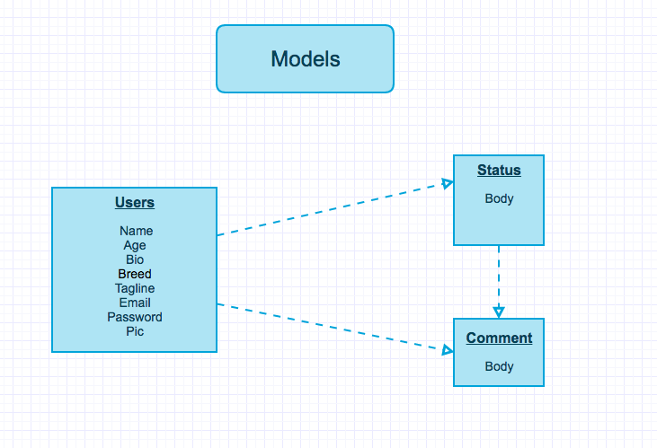
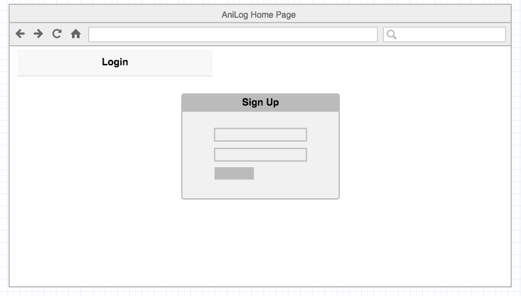
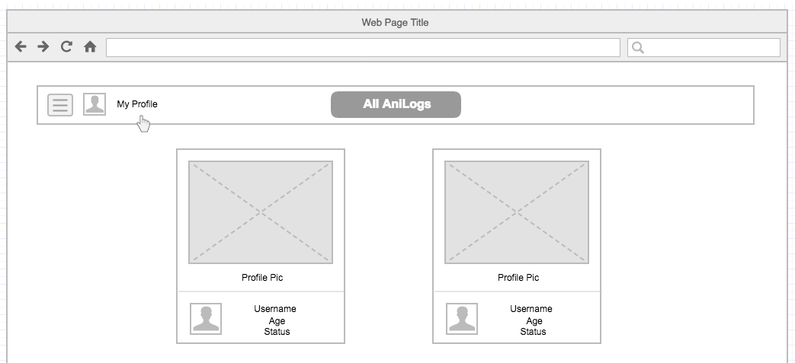
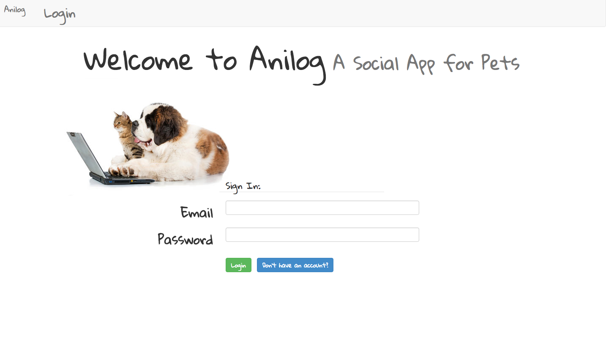

#**Anilog!**

##A Ruby on Rails Based Social App for Your Pet

This webapp is designed with the purpose of creating an online community for pets (and thier owners) to connect and share their journey.

There are channels on YouTube dedicated to animals.  There are IG accounts created specifically for pets.  But there is no place for an animals voice to be heard (not in the literal sense, of course).  Now there's a webapp where pet owners can be their pet's voice.  

##How do I Join?

Check out the following link to join Anilog (https://shielded-stream-97248.herokuapp.com/).  This site provides a secure way to create a profile and login information with an email and password.  Upload a profile pic and you're ready to start socializing with other pet owners.  You can update your pet's status,  visit other Anilogs and comment on their status.

## Development Process

Technologies Used: RoR / Bootstrap / HTML / CSS

By creating models, controllers, and actions in RoR, users of this site are able to create new profiles, log in and out, view other profiles, and add comments to other users' status.  BCrypt gives users a secure way to create and access their profiles.  Bootstrap and paperclips gems were used for styling and to give users the capability of uploading photos.  

## Not-Yet-Implemented

* Uploading videos
* Detailed graphic design
* Link to other social media platforms

###User Stories

1. As a user, I can create a profile by providing a name, age, breed, bio, email address, password, and tagline for my pet.

2. As a user, I can upload photos and update my pet's status daily.

3. As a user, I can view other Anilogs.

4. As a user, I can comment on the status of other Anilogs.

##Future Implementations

1. As a user, I want to follow other Anilogs.

2. As a user, I want to like other Anilogs and/or their status.

3. As a user, I want to upload videos.

4. As a user, I want to share my Anilog on other platforms such as Facebook, IG, etc.

5. As a user, I want to change my login information when necessary.

6.  As a user, I want to delete old statuses.

7. As a user, I want to add multiple photos to my profile and attach photos to my status updates.

##Credits

Thank you to everyone who assisted me with this project.

* Philippe

* Jimmy

* TA Kev

* TA Conrad

* Troy

* Roland
